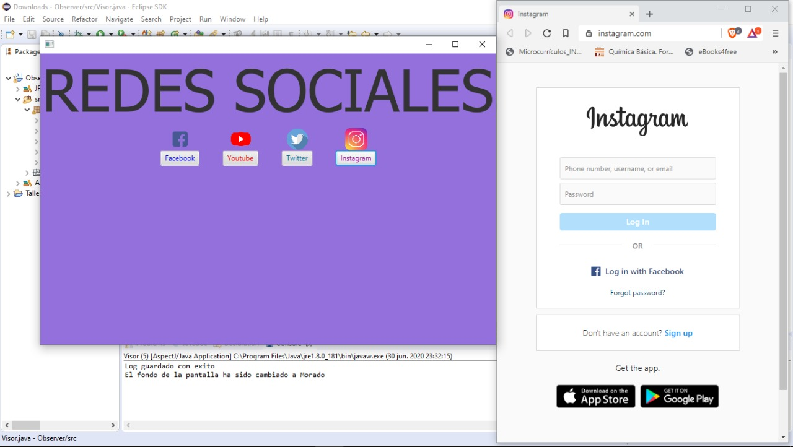

# Tarea_Aspectos

El presente programa usa una interfaz de usuario simplificada en la que muestra al usuario cuatro redes sociales a las que puede navegar pulsando el botón correspondiente. 
Al seleccionar una de las opciones el usuario es redirigido a la pagina web de la seleccionada red social y se colorea la pantalla de acuerdo al color representativo de la red, además mediante el uso de aspectos se presenta en la consola el cambio realizado en la pantalla.

#### Funcionalidad de aspectos extra:
Cuando el usuario selecciona una de las redes sociales un aspecto se encarga de registrar esta nueva navegación en la web. Se registra la fecha, hora y red social elegida. 
